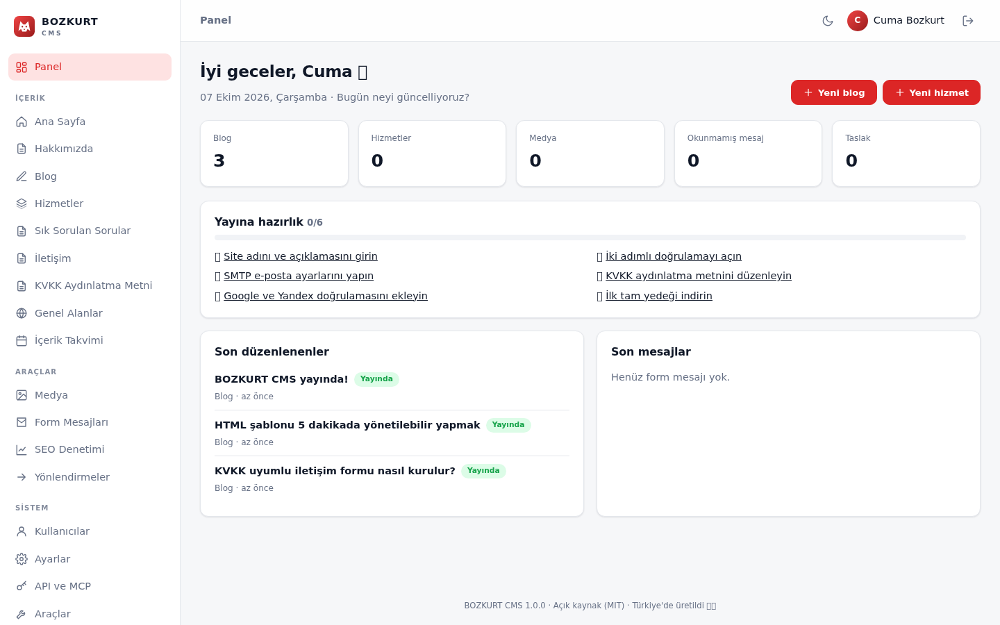

<p align="center"></p>

<h1 align="center">BOZKURT CMS</h1>

<p align="center">
<a href="https://github.com/cumabozkurt/bozkurt-cms/actions/workflows/denetim.yml"></a>
<a href="https://github.com/cumabozkurt/bozkurt-cms/releases/latest"></a>

<a href="LICENSE"></a>
</p>

<p align="center"><strong>Tasarımcılar için Türkçe, hızlı ve güvenli açık kaynak içerik yönetim sistemi.</strong><br>
Herhangi bir HTML şablonuna birkaç etiket ekleyin, siteniz dakikalar içinde yönetilebilir olsun.<br>
PHP 8.1+ · Composer gerekmez · SQLite veya MySQL · Çok dilli · Yapay zekâ hazır · Hostinger ve tüm paylaşımlı hostinglerde çalışır.</p>

<p align="center"></p>

---

## Neden BOZKURT?

CouchCMS'in “HTML'e etiket ekle, CMS olsun” fikri harikaydı; ama 2010'ların teknolojisiyle (mysql_* uyumluluk katmanı, jQuery, CKEditor 4, KCFinder, timthumb, phpass, Türkçe desteği yok) kaldı. BOZKURT aynı kolaylığı **sıfırdan, modern PHP ile** yeniden kurar ve Türkiye'nin ihtiyaçlarını (KVKK, Türkçe karakterler, ₺, yerel hosting) baştan hesaba katar.

| | CouchCMS 2.x | BOZKURT CMS 1.0 |
|---|---|---|
| PHP | 5.x mirası, `mysql_*` + mysql2i | PHP 8.1+ `strict_types`, PDO |
| Veritabanı | Yalnızca MySQL | **SQLite (sıfır ayar)** veya MySQL/MariaDB |
| Kurulum | `config.php` elle düzenlenir | **Tek ekranlık web sihirbazı** |
| Şablonların tanınması | Şablonu yönetici olarak ziyaret etmek gerekir | `sablonlar/` klasörüne koymak yeterli, otomatik tarama |
| Şablon motoru | Her istekte ayrıştırma | **PHP'ye derlenir**, OPcache dostu |
| Önbellek | Basit | Tam sayfa önbellek + otomatik temizleme |
| Editör | CKEditor 4 + KCFinder | Bağımlılıksız editör + medya kütüphanesi + sunucu tarafı HTML temizleyici |
| Resim | timthumb | GD ile WebP küçük resim, EXIF/konum temizliği |
| Güvenlik | phpass, captcha | `password_hash`, **2FA (TOTP)**, kaba kuvvet kilidi, CSRF, bal küpü |
| Türkçe | Yok | **Varsayılan**: arayüz, slug, tarih, ₺, telefon, İ/ı |
| KVKK | Yok | Çerez onay bandı, açık rıza kutusu, IP anonimleştirme, saklama süresi |
| API | Yok | Okuma/yazma JSON API, MCP sunucusu, web kancaları |
| Yedek | SQL dökümü | DB'den bağımsız JSON/ZIP (SQLite ⇄ MySQL taşıma) |
| Çok dil | Yok | `/en/` önekleri, hreflang, çeviri iş akışı |
| Yapay zekâ | Yok | YZ yardımcısı, llms.txt, `.md` sürümler, MCP sunucusu |
| Ödeme | PayPal eklentisi | PayTR, iyzico |
| Lisans | CPAL (atıf kaldırılamaz) | **MIT** |

## Özellikler

**Tasarımcı için**
- Etiketle yönetilebilir HTML: `<bz:alan>`, `<bz:tekrar>`, `<bz:bloklar>`, `<bz:liste>`, `<bz:eger>`, `<bz:form>`, `<bz:genel>`, `<bz:resim>`, `<bz:dil-secici>`…
- 26 alan türü: zengin metin, Markdown, resim, fiyat (₺), ilişki, video, harita, tekrarlanan grup, **blok düzenleyici**, il, TCKN, VKN, IBAN…
- Panelde şablon denetleyici (kapatılmamış etiket, geçersiz alan adı uyarısı)

**Editör için**
- Taslak, zamanlanmış yayın, önizleme, 25 sürümlük geçmiş, kopyalama, **yerel otomatik taslak**
- **Ön yüzde satır içi düzenleme**, içerik takvimi (resmî tatiller işaretli), kelime sayacı
- **✨ Yapay zekâ yardımcısı:** yazım düzeltme, özet, başlık önerisi, SEO metni, toplu çeviri, görselden alt metin (OpenAI, Gemini, Groq, OpenRouter, yerel Ollama…)
- Canlı Türkçe SEO analizi ve puanı

**Çok dilli**
- `/en/`, `/de/`, `/ar/`… önekleri, çeviri iş akışı, `hreflang` + `x-default`, dil başına genel alanlar, şablon metin sözlükleri, RTL

**SEO ve yapay zekâ görünürlüğü**
- Otomatik meta/OG/canonical/JSON-LD (WebSite, Article, Breadcrumb, FAQPage, LocalBusiness), görselli ve hreflang'li sitemap
- 301 yönlendirme yöneticisi, slug değişince otomatik 301, 404 günlüğü, kanonik adres düzeltme, site geneli SEO denetimi
- **llms.txt, llms-full.txt, her sayfanın `.md` sürümü**, robots.txt'de YZ bot politikası

**Entegrasyon**
- REST API (okuma/yazma, kapsamlı anahtarlar), **MCP sunucusu** (Claude, ChatGPT, Cursor), web kancaları (Zapier, Make, n8n)
- WordPress içe aktarıcı, statik site dışa aktarma, tek tıkla güncelleme

**Türkiye paketi**
- KVKK: çerez onayı, açık rıza, IP anonimleştirme, saklama süresi · İYS onayı
- **PayTR ve iyzico** ödeme, siparişler, e-Fatura CSV · **Netgsm SMS** bildirimi
- Türkçe slug, İ/ı, tarih, ₺, telefon · Yandex doğrulama ve Metrica · LocalBusiness

**Pazarlama**
- GA4, Meta Pixel, Yandex Metrica (onay sonrası), form dönüşüm olayları, **UTM yakalama**, WhatsApp düğmesi

**Güvenlik ve işletme**
- 2FA (tekrar oynatma korumalı), IP + hesap bazlı kilit, CSP/HSTS, oturum süreleri, şifre sıfırlama, roller, etkinlik günlüğü
- Beyaz etiket, panel İngilizce dili, yayına hazırlık listesi, DB'den bağımsız yedek
- 145 kontrollü otomatik test (SQLite ve MySQL), PHPStan seviye 5, PHP 8.1–8.4 CI

## Hızlı kurulum (Hostinger ve diğer paylaşımlı hostingler)

1. [Son sürümü indirin](../../releases) ve ZIP'i bilgisayarınızda açın.
2. hPanel › **Dosya Yöneticisi** (veya FTP) ile tüm dosyaları `public_html/` içine yükleyin.
3. hPanel › **Gelişmiş › PHP Yapılandırması**'ndan PHP **8.1 veya üzeri** seçin (8.3 önerilir).
4. Tarayıcıda `https://alanadiniz.com/yonetim/` adresini açın, formu doldurun. Bitti.

> SQLite için hiçbir ayar gerekmez. MySQL tercih ederseniz önce hPanel › **Veritabanları** › MySQL'den bir veritabanı ve kullanıcı oluşturun.

Ayrıntılı rehber: [docs/HOSTINGER-KURULUM.md](docs/HOSTINGER-KURULUM.md)

### Yerel geliştirme

```bash
git clone https://github.com/cumabozkurt/bozkurt-cms.git && cd bozkurt-cms
php -S localhost:8000 yonlendirici.php
# http://localhost:8000/yonetim/

php testler/kapsamli.php   # 105 uçtan uca + güvenlik testi (MySQL: BZ_TEST_MYSQL="sunucu;port;db;kullanici;sifre")
php testler/tarama.php     # tüm site ve panel taraması (bağlantı, HTML, SEO, yedek)
```

## 60 saniyede şablon

`sablonlar/hizmetler.html` oluşturun:

```html
<bz:sablon baslik="Hizmetler" coklu="evet" sira="4" />
<bz:dahil dosya="parcalar/ust" />

<bz:alan ad="gorsel"  tur="resim"  etiket="Görsel"  goster="hayir" />
<bz:alan ad="fiyat"   tur="fiyat"  etiket="Fiyat"   goster="hayir" />
<bz:alan ad="aciklama" tur="zengin" etiket="Açıklama" goster="hayir" />

<bz:eger kosul="gorunum == 'tekil'">
  <h1>{{ baslik }}</h1>
  
  <p class="fiyat">{{ fiyat | tl }}</p>
  {{{ aciklama }}}
<bz:degilse/>
  <bz:liste limit="12" sirala="sira" yon="artan" sayfalama="evet">
    <a href="{{ oge.url }}">{{ oge.baslik }} — {{ oge.fiyat | tl }}</a>
  <bz:yoksa/>
    <p>Henüz hizmet eklenmedi.</p>
  </bz:liste>
  <bz:sayfalama />
</bz:eger>

<bz:dahil dosya="parcalar/alt" />
```

Paneli yenileyin: soldaki menüde **Hizmetler** belirir; `/hizmetler` liste, `/hizmetler/web-tasarim` detay sayfasıdır.
Tüm etiketler ve süzgeçler: **[docs/SABLON-REHBERI.md](docs/SABLON-REHBERI.md)**

## Klasör yapısı

```
index.php            Ön yüz giriş noktası
yonetim/             Yönetim paneli + kurulum sihirbazı (assets/ içinde CSS/JS)
bozkurt/             Çekirdek (src/), dil dosyaları, panel görünümleri — web erişimine kapalı
sablonlar/           Sizin HTML şablonlarınız (parcalar/ = ortak parçalar) — web erişimine kapalı
tema/                Şablonların CSS/JS/görselleri (herkese açık)
yuklemeler/          Yüklenen medya — PHP çalıştırma kapalı
veri/                Yapılandırma, SQLite, önbellek, oturumlar — web erişimine kapalı
docs/                Belgeler
```

## Belgeler

- [Şablon dili rehberi](docs/SABLON-REHBERI.md)
- [Yapay zekâ katmanı: YZ yardımcısı, llms.txt, MCP, API](docs/YAPAY-ZEKA.md)
- [5 uzman gözüyle inceleme](docs/INCELEME-5-UZMAN.md)
- [Agresif güvenlik denetimi (3 bakış açısı)](docs/GUVENLIK-DENETIMI.md)
- [Son tarama raporu (5 açı)](docs/SON-TARAMA.md)
- [Hostinger kurulumu ve SSS](docs/HOSTINGER-KURULUM.md)
- [CouchCMS uçtan uca analizi](docs/ANALIZ-COUCHCMS.md)
- [25 popüler CMS reposunun karşılaştırması](docs/KARSILASTIRMA-25-REPO.md)
- [Güvenlik modeli](docs/GUVENLIK.md)
- [Yol haritası](docs/YOL-HARITASI.md)
- [Katkı rehberi](CONTRIBUTING.md)

## Gereksinimler

PHP 8.1+ · `pdo_sqlite` veya `pdo_mysql` · `mbstring` · `fileinfo` · `dom` · önerilen: `gd` (WebP), `zip`.
Apache/LiteSpeed (`.htaccess` hazır), Nginx (`nginx.conf.ornek`) veya IIS (`web.config`).

## Lisans

[MIT](LICENSE) — ticari projelerde özgürce kullanın, beyaz etiketleyin. BOZKURT CMS, CouchCMS'ten kod içermez; fikir ilhamı için CouchCMS ekibine teşekkürler.
