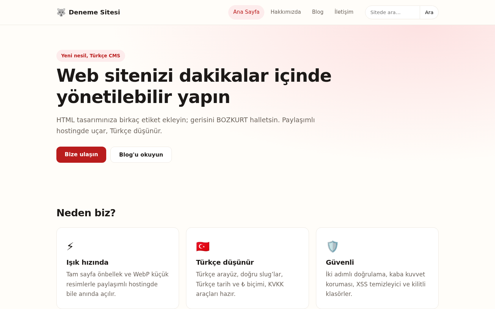
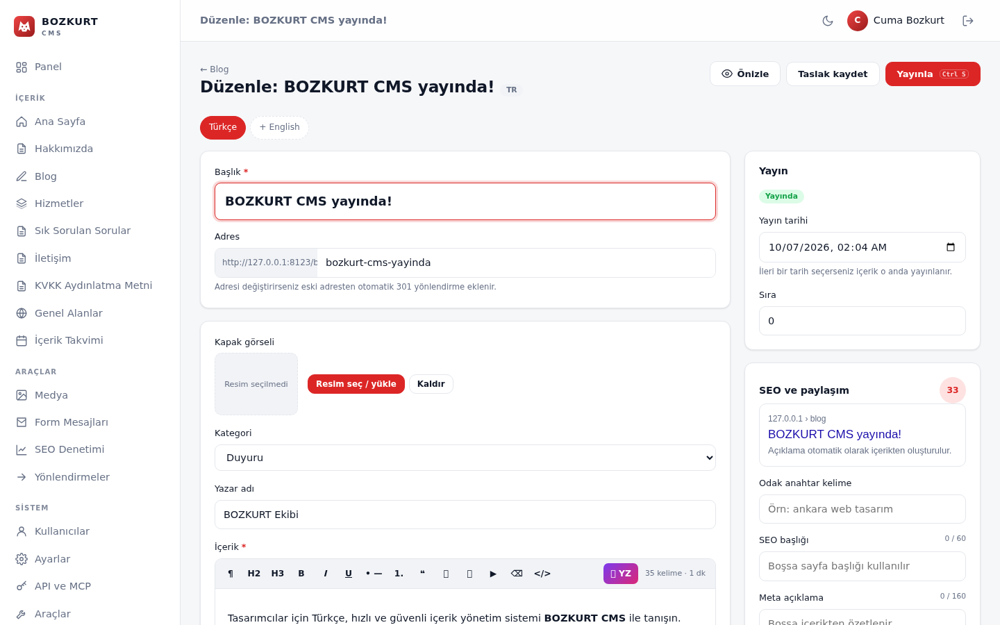
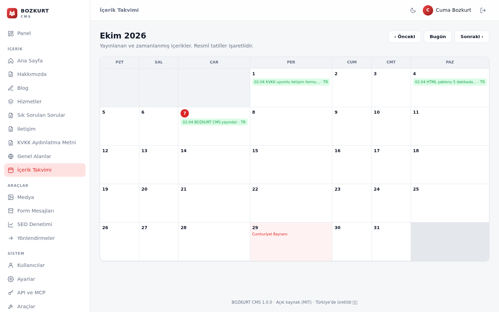
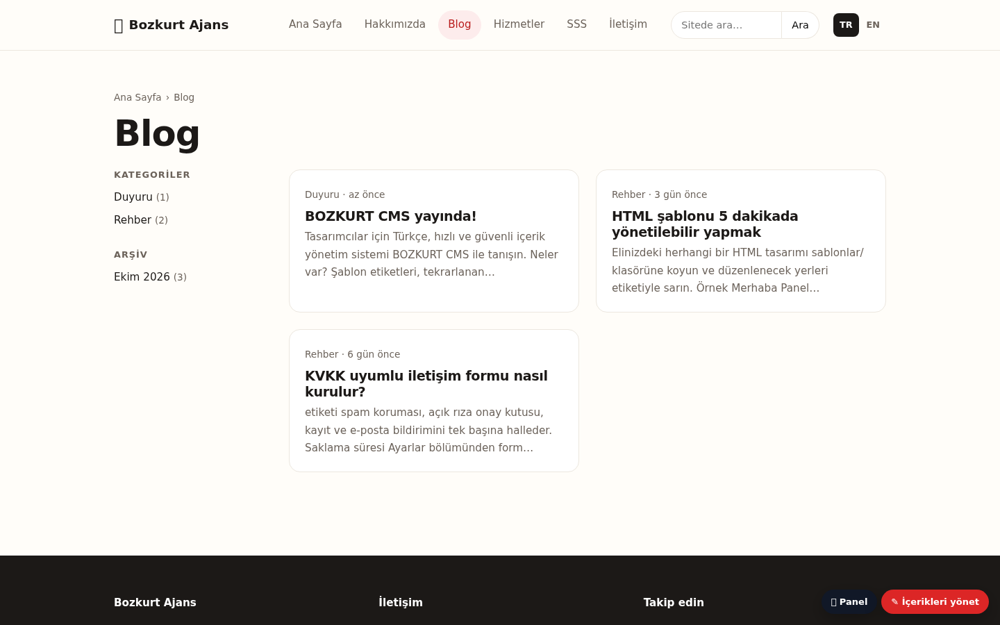
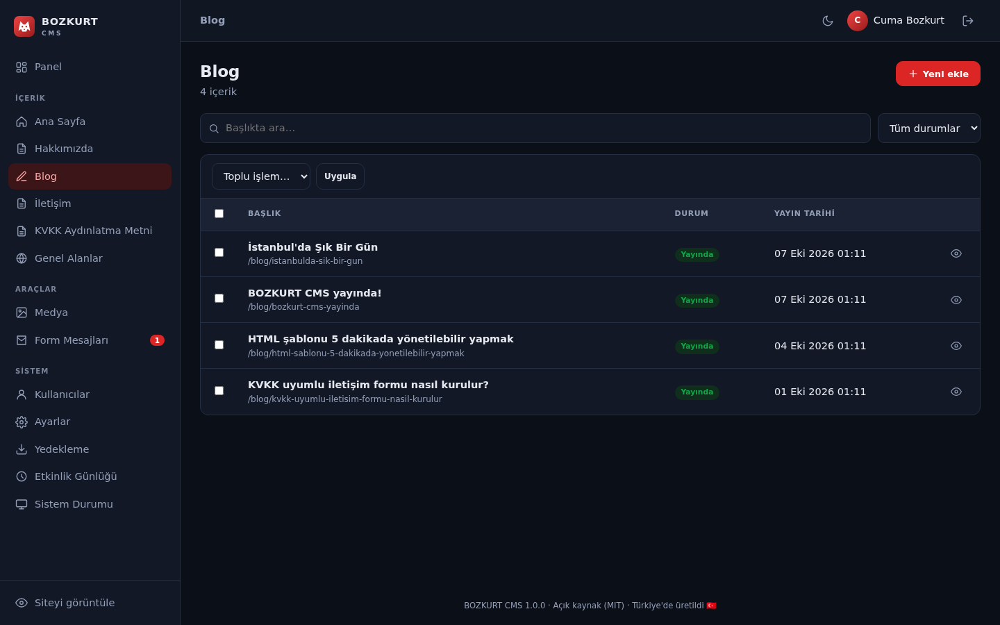
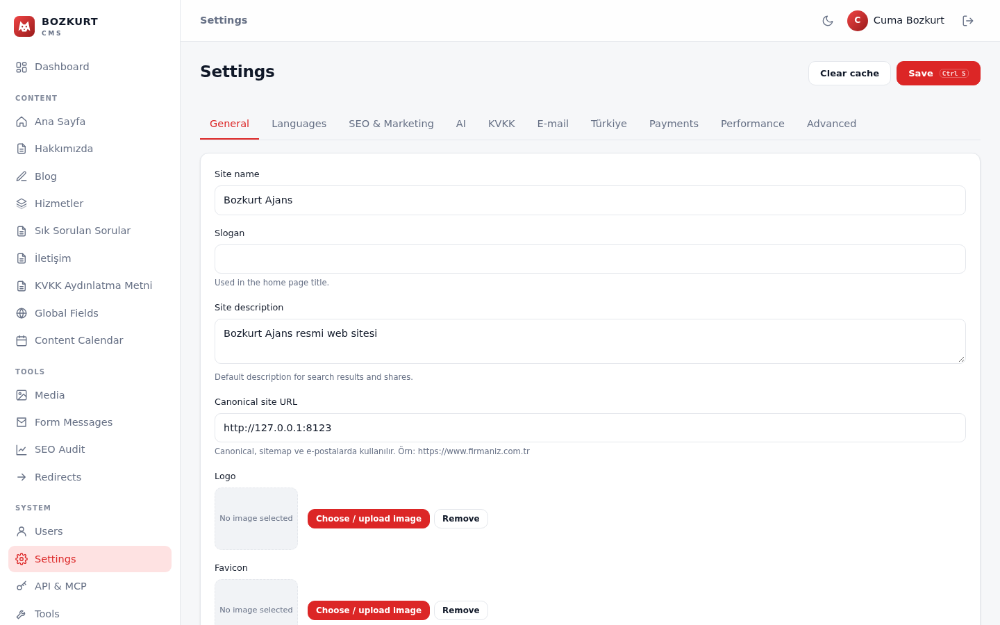

<p align="center"></p>

<h1 align="center">BOZKURT CMS</h1>

<p align="center"><strong>English</strong> · <a href="README.tr.md">Türkçe</a></p>

<p align="center">
<a href="https://github.com/cumabozkurt/bozkurt-cms/actions/workflows/denetim.yml"></a>


<a href="LICENSE"></a>
</p>

<p align="center"><strong>A fast, secure, open-source CMS for designers — built Turkish-first.</strong><br>
Add a few tags to any HTML template and the site becomes editable in minutes.<br>
PHP 8.1+ · no Composer · SQLite or MySQL · multilingual · AI-ready · runs on ordinary shared hosting.</p>

<p align="center"></p>

> **About the language:** BOZKURT is built for Turkish users first. The admin panel is Turkish by default
> (an English panel language ships in `bozkurt/lang/panel-en.php`), and template tags, field types and
> code identifiers use Turkish words (`<bz:alan>` = field, `<bz:liste>` = list, `<bz:eger>` = if).
> This README and [`docs/en/`](docs/en/) explain everything in English.

---

## Why BOZKURT?

CouchCMS popularised the idea of "add tags to your HTML and it becomes a CMS". BOZKURT rebuilds that
workflow **from scratch with modern PHP**, with no third-party runtime dependencies, and designs in
Turkey-specific needs from day one: KVKK (Turkish GDPR) consent tools, correct Turkish casing (İ/ı),
Turkish slugs, ₺ prices, local payment providers and shared-hosting compatibility. It contains no
CouchCMS code.

## Features

**For designers**
- Make plain HTML editable with tags: `<bz:alan>`, `<bz:tekrar>`, `<bz:bloklar>`, `<bz:liste>`, `<bz:eger>`, `<bz:form>`, `<bz:genel>`, `<bz:resim>`, `<bz:dil-secici>` …
- Templates are compiled to cached PHP (OPcache-friendly); raw PHP inside templates is never executed.
- 26 field types: rich text, Markdown, image, file, price (₺), relation, video, map, repeater, **block editor**, Turkish province, TCKN (national ID), VKN (tax number), IBAN …
- 29 output filters (`tarih`, `tl`, `kisalt`, `resim:"800x600"`, `markdown`, `video` …).
- Built-in template linter in the panel (unclosed tags, unknown tags/field types, invalid field names).

**For editors**
- Drafts, scheduled publishing, preview, 25-revision history, duplication, local autosave.
- **Front-end inline editing**, content calendar with Turkish public holidays, word counter.
- Optional **AI assistant** for any OpenAI-compatible API (OpenAI, Gemini, Groq, OpenRouter, local Ollama …): proofreading, summaries, title suggestions, SEO text, bulk translation, image alt text.
- Live SEO analysis and score while editing.

**Multilingual**
- Language prefixes (`/en/`, `/de/`, `/ar/` …), translation workflow, `hreflang` + `x-default`, per-language global fields, template string dictionaries, RTL support.

**SEO and AI visibility**
- Automatic meta, Open Graph, canonical and JSON-LD (WebSite, Article, BreadcrumbList, FAQPage, LocalBusiness); sitemap with images and hreflang; RSS.
- 301 redirect manager, automatic 301 when a slug changes, 404 log, canonical URL normalisation (trailing slash, letter case, `index.php`), site-wide SEO audit.
- `llms.txt`, `llms-full.txt`, a Markdown (`.md`) version of every page, AI-crawler policy in `robots.txt`.

**Integrations**
- REST API (`/api/v1`, read/write, scoped keys, rate limiting), **MCP server** at `/mcp` for AI clients, HMAC-signed webhooks (Zapier, Make, n8n …).
- WordPress importer, static site export, one-click updater (verifies a SHA-256 checksum).

**Turkey pack**
- KVKK: cookie consent banner, explicit-consent checkbox, IP anonymisation, data-retention period; İYS (commercial messaging) consent.
- **PayTR and iyzico** payments, orders, e-invoice CSV export; **Netgsm** SMS notifications.
- Yandex verification and Metrica, LocalBusiness schema, Turkish holiday calendar.

**Marketing**
- GA4, Meta Pixel and Yandex Metrica (loaded only after consent), form conversion events, UTM capture, WhatsApp button.

**Security and operations**
- `password_hash`, TOTP 2FA with replay protection, IP + account lockout, CSRF tokens, honeypot, CSP/HSTS headers, roles (admin / editor / author), activity log, password reset.
- DOM-based allow-list HTML sanitizer for rich text; SSRF guards for webhooks and the AI endpoint.
- White-labelling, English panel language, go-live checklist, database-independent JSON/ZIP backups (SQLite ⇄ MySQL migration).
- 240+ automated checks in 4 test suites, PHPStan level 5, CI on PHP 8.1–8.4 and MySQL 8.

## Screenshots

| Website (bundled demo templates) | Content editor with SEO panel | Content calendar |
|---|---|---|
|  |  |  |

| Blog (demo) | Dark panel theme | English panel language |
|---|---|---|
|  |  |  |

## Quick start

### Requirements

- PHP **8.1+** with `pdo_sqlite` **or** `pdo_mysql`, `mbstring`, `fileinfo`, `dom` (recommended: `gd` for WebP thumbnails, `zip` for backups/updates, `curl`).
- Apache / LiteSpeed (`.htaccess` included), Nginx (`nginx.conf.ornek`) or IIS (`web.config`).
- SQLite (zero configuration) or MySQL / MariaDB.

### Shared hosting (Hostinger, cPanel, Plesk …)

1. Download the code. No GitHub release has been published yet, so use **Code › Download ZIP**
   (or `git clone`). Once releases exist, download the latest `bozkurt-cms-x.y.z.zip`.
2. Upload all files to your web root (e.g. `public_html/`).
3. Select PHP 8.1 or newer in your hosting panel (8.3 recommended).
4. Open `https://your-domain.com/yonetim/` and complete the one-page installer.

SQLite needs no setup. For MySQL, create a database and user first. Step-by-step Hostinger guide (Turkish):
[docs/HOSTINGER-KURULUM.md](docs/HOSTINGER-KURULUM.md).

### Local development

```bash
git clone https://github.com/cumabozkurt/bozkurt-cms.git && cd bozkurt-cms
php -S localhost:8000 yonlendirici.php
# open http://localhost:8000/yonetim/ and run the installer
```

More: [docs/en/getting-started.md](docs/en/getting-started.md)

## A template in 60 seconds

Create `sablonlar/hizmetler.html` ("services"):

```html
<bz:sablon baslik="Hizmetler" coklu="evet" sira="4" />
<bz:dahil dosya="parcalar/ust" />

<bz:alan ad="gorsel"  tur="resim"  etiket="Görsel"  goster="hayir" />
<bz:alan ad="fiyat"   tur="fiyat"  etiket="Fiyat"   goster="hayir" />
<bz:alan ad="aciklama" tur="zengin" etiket="Açıklama" goster="hayir" />

<bz:eger kosul="gorunum == 'tekil'">
  <h1>{{ baslik }}</h1>
  
  <p class="fiyat">{{ fiyat | tl }}</p>
  {{{ aciklama }}}
<bz:degilse/>
  <bz:liste limit="12" sirala="sira" yon="artan" sayfalama="evet">
    <a href="{{ oge.url }}">{{ oge.baslik }} — {{ oge.fiyat | tl }}</a>
  <bz:yoksa/>
    <p>Henüz hizmet eklenmedi.</p>
  </bz:liste>
  <bz:sayfalama />
</bz:eger>

<bz:dahil dosya="parcalar/alt" />
```

Reload the panel: **Hizmetler** appears in the sidebar; `/hizmetler` is the list page and
`/hizmetler/web-tasarim` a detail page. `coklu="evet"` means "multiple entries", `{{ }}` prints escaped
output and `{{{ }}}` prints sanitized HTML. This exact example is compiled and linted by the unit tests.

Full reference: [docs/en/template-language.md](docs/en/template-language.md) (English) ·
[docs/SABLON-REHBERI.md](docs/SABLON-REHBERI.md) (Turkish, complete).

## Configuration

The installer writes `veri/yapilandirma.php` (database driver, secret key, timezone, default language,
pretty URLs, debug mode). Everything else — site identity, languages, SEO, AI, KVKK, SMTP, payments,
cache, API and webhooks — is managed in **Yönetim › Ayarlar** (Admin › Settings) and stored in the database.
See [docs/en/configuration.md](docs/en/configuration.md).

## Architecture

```
index.php            Front-end entry point → Bozkurt\Site::run()
yonetim/             Admin panel + installer entry point (assets/ = panel CSS/JS)
bozkurt/             Core — not web-accessible
  boot.php           Constants, autoloader, App::boot()
  src/               Classes (namespace Bozkurt): Site, Admin, Template, Runtime, Content, Api, Mcp …
  gorunumler/        Admin panel views
  lang/              Panel translations (English)
sablonlar/           Your HTML templates (parcalar/ = partials, diller/ = string dictionaries) — not web-accessible
tema/                Public CSS/JS/images used by templates
yuklemeler/          Uploaded media — script execution disabled
veri/                Config, SQLite database, caches, sessions, logs — not web-accessible
testler/             Test suites (unit, smoke, end-to-end, crawl)
bin/                 CLI helpers
docs/                Documentation
```

Request flow, database schema and the template compiler are described in
[docs/en/architecture.md](docs/en/architecture.md).

## Documentation

| English | Türkçe |
|---|---|
| [Getting started](docs/en/getting-started.md) | [Hostinger kurulumu ve SSS](docs/HOSTINGER-KURULUM.md) |
| [Configuration](docs/en/configuration.md) | [Yapılandırma](docs/YAPILANDIRMA.md) |
| [Architecture](docs/en/architecture.md) | [Mimari](docs/MIMARI.md) |
| [Template language](docs/en/template-language.md) | [Şablon dili rehberi](docs/SABLON-REHBERI.md) |
| [REST API, MCP and webhooks](docs/en/api.md) | [Yapay zekâ katmanı, MCP, API](docs/YAPAY-ZEKA.md) |
| [Deployment](docs/en/deployment.md) | [Hostinger kurulumu](docs/HOSTINGER-KURULUM.md) |
| [Security model](docs/en/security.md) | [Güvenlik modeli](docs/GUVENLIK.md) |
| [Testing](docs/en/testing.md) | [Katkı rehberi](CONTRIBUTING.md) |
| [FAQ](docs/en/faq.md) | [Yol haritası](docs/YOL-HARITASI.md) |

Full index: [docs/README.md](docs/README.md)

## Testing

```bash
php testler/birim.php      # unit tests (sanitizer, template compiler, filters, validators, TOTP)
php testler/duman.php      # smoke test
php testler/kapsamli.php   # end-to-end + attacker scenarios (MySQL: BZ_TEST_MYSQL="host;port;db;user;pass")
php testler/tarama.php     # crawls every site and panel page (links, HTML, SEO, backups)
phpstan analyse -c phpstan.neon.dist
```

The [CI workflow](.github/workflows/denetim.yml) runs all of the above on PHP 8.1–8.4, plus the end-to-end suite
against MySQL 8 and a syntax check of the panel JavaScript. See [docs/en/testing.md](docs/en/testing.md).

## Roadmap

Planned work (from [docs/YOL-HARITASI.md](docs/YOL-HARITASI.md)):

- **1.1 — Quality:** split `Admin.php` into section classes, nonce-based panel CSP, revision diff view, automatic `preload` for the LCP image, image focal point for cropping.
- **1.2 — Expansion:** multi-site, signed plugin system and hooks, cart/stock and shipping integrations, direct e-invoice integrations.

## Contributing

Contributions are welcome — please read [CONTRIBUTING.md](CONTRIBUTING.md) and the
[Code of Conduct](CODE_OF_CONDUCT.md). Report security issues privately as described in [SECURITY.md](SECURITY.md).
Changes are tracked in [CHANGELOG.md](CHANGELOG.md).

## License

[MIT](LICENSE) © Cuma Bozkurt and BOZKURT CMS contributors. Free for commercial use and white-labelling.
Thanks to the CouchCMS team for the original idea.
